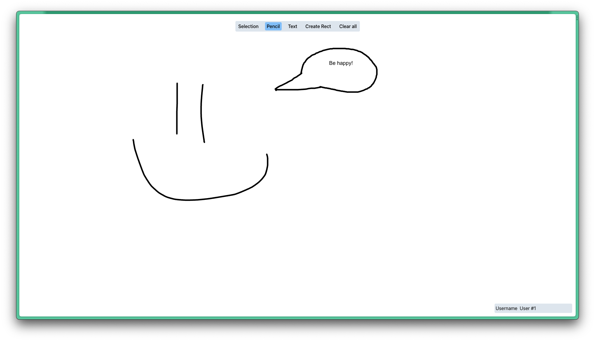

# Dashboard editor

[Dashboard editor](https://dashboard-editor-project.vercel.app/)

For this project, I leveraged the HTML Canvas API to create a highly interactive and visually engaging web application. I paid special attention to performance optimization, ensuring that the app runs smoothly on various devices and browsers

One of the project's standout features is its well-structured codebase, designed with scalability in mind. This solid foundation not only makes it easy to maintain but also allows for the seamless addition of new features and enhancements in the future. The project showcases my commitment to creating efficient, user-friendly, and expandable web applications.

## Key Features

 - Freehand Drawing: Users can express their creativity by drawing freehand using a pencil tool.
 - Rectangle Creation: The application allows users to create precise rectangles with ease.
 - Text Element Addition: Users can add text elements to the canvas, enhancing their designs with customized text.
 - Element Manipulation: All shapes, pencil lines, and text elements can be moved around the canvas, giving users control over their creations.
 - Rectangle Resizing: Created rectangles can be resized, enabling users to adjust dimensions as needed.

These features collectively provide a comprehensive set of tools for both artistic expression and practical design within the web application.

Inspired by [Excalidraw](https://excalidraw.com/)

## Used technologies

- [React](https://react.dev/)
- [Vite](https://vitejs.dev/)
- [Konva](https://konvajs.org/)
